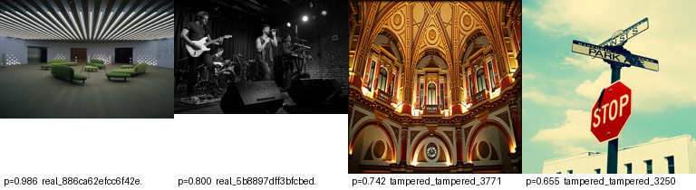
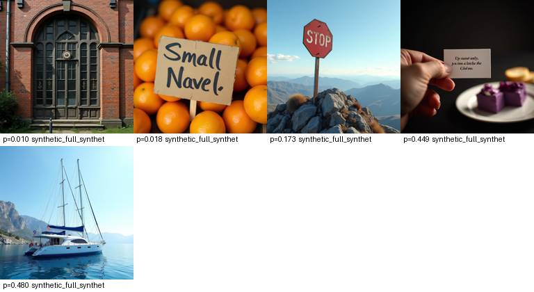

# Error Analysis Note

Split `test` | 2228 images | threshold 0.5

- False positives (real called AI): **4** (0.3% of real images)
- False negatives (AI called real): **5** (0.7% of AI images)

## Error rate by image kind

| Kind | total | false pos | false neg | error rate |
|---|---|---|---|---|
| synthetic | 747 | 0 | 5 | 0.7% |
| tampered | 744 | 2 | 0 | 0.3% |
| real | 737 | 2 | 0 | 0.3% |

## Interpretation

> Write this by hand after looking at the grids. Questions to answer:
>
> 1. Do the false positives share a visual property (heavy texture,
>    shallow depth of field, smooth skin, low resolution)? Real photos
>    with smooth regions getting flagged means the model reads 'lack of
>    high-frequency detail' as 'synthetic' -- a real artifact signal
>    misfiring, not a bug.
> 2. Do the tampered images fail more often than genuine photos? That
>    is the AI-edited region leaking a detectable signal.
> 3. What is the cost asymmetry? Calling a real photograph synthetic is
>    an accusation against a person; missing a synthetic image is a gap
>    in coverage. State which error the threshold favours.